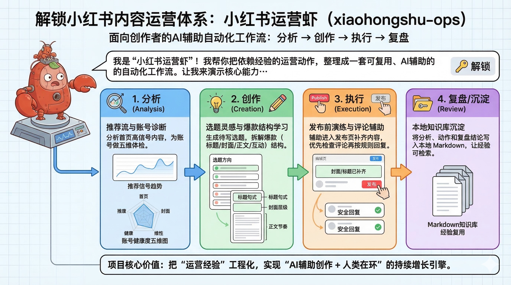
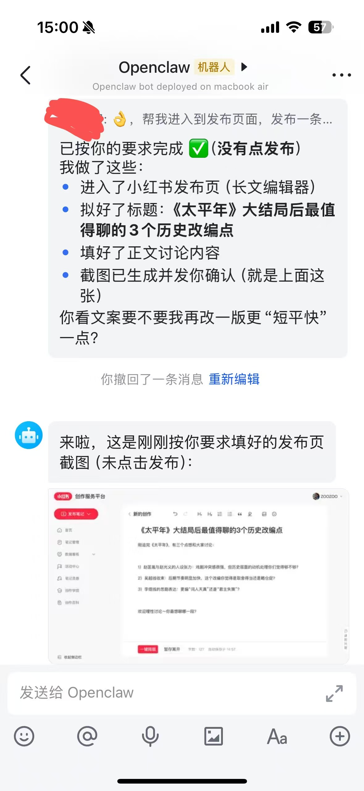
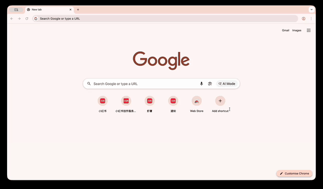

<!--
  xiaohongshu-ops skill README
-->

# xiaohongshu-ops (Dog-XHS) — 小红书全自动 AI 运营与爆款复刻 Skill

<div align="left">

[](LICENSE)
[](https://github.com/openclaw/openclaw)
[-green.svg)](#-核心能力)
[](llms.txt)

</div>

> **小红书自动运营 Skill**：搭配 OpenClaw 可以独立运营小红书账号，帮你一键实现**推荐流分析、账号体检、选题灵感生成、爆款笔记复刻、图文自动发布与评论智能回复**。基于真实浏览器自动化 (CDP)，安全稳定无需频繁校验。



## What's New
- **03.19**：重点转向AI辅助创作和分析，新增`推荐流分析`,`账号分析`,`选题灵感`,`知识库`
- **02.28**: 爆款笔记复刻，输入爆款笔记链接，分析爆款因素，生成类似的笔记，包含图文
- **02.27**: nano banana生成封面图，并通过图文发布流程发布 （需要gemini_api_key, 可白嫖)

## 核心能力
- ✅ 首页推荐流分析：为什么这些高赞笔记能被推荐给你？背后的传播钩子和内容结构是什么？
- ✅ 账号分析：分析账号定位，不同笔记之间的区别，为什么这个笔记赞更多
- ✅ 选题灵感：结合知识库、账号定位，提供选题灵感和内容
- ✅ 知识库：分析结果和动作会被保存下来（markdown），为未来决策和复盘提供便利

- ✅ 自动发布笔记：生成封面并上传，填写正文/标题
- ✅ 自动回复评论：通知评论逐个回复
- ✅ 目标笔记下载：下载URL笔记图片和正文
- ✅ 爆款笔记复刻：输入爆款笔记链接，发布相似笔记
- ✅ persona.md：账号定位和人设，设定回复语气

### 1. 首页推荐流分析
```
帮我分析一下我小红书首页推荐流，为什么这些高赞笔记会被推荐给我？
```

真实结果（本次测试精简）：
- 首页高互动内容集中在 **AI 工具 + 踩坑复盘**
- 高赞标题普遍是“情绪词 + 具体对象”：如「被 claude 惊到了！」
- 可复用模式：先抛情绪冲突，再给具体场景，再引导站队评论
- 建议动作：用 3 套标题骨架做 A/B（被___惊到了 / 折腾___后我麻了 / 别再___了）

### 2. 账号分析
```
帮我分析这个账号定位和最近笔记表现，为什么有些笔记点赞明显更高？
```

真实结果（本次测试精简）：
- 账号样本：`喃喃Tech`，近期由风景日常转向 AI 话题
- 数据断层明显：置顶 AI 内容点赞 **3191 / 1911**，历史大量内容仅 **1-10**
- 结论：高赞来自“AI 热词 + 情绪冲突标题 + 置顶曝光”
- 下步动作：连续 7 条 AI 主题统一风格发布，暂停低相关题材

### 3. 选题灵感
```
结合我的账号定位和最近平台热点，给我 5 条能直接发布的小红书选题
```

真实结果（本次测试精简）：
- 产出 5 条可发选题，优先级最高的是：
  1) 被 AI 惊到后，我改掉了 3 个坏习惯
  2) 别再迷信“一键起号”了，真正难的是连续输出
  3) 折腾 Agent 自动化 21 天，我只留下这 2 套流程
- 每条已配互动钩子与三段结构，可直接进入写稿

### 4. 知识库沉淀
```
把这次分析结果和动作沉淀到知识库，方便后续复盘复用
```

真实结果（本次测试落库文件）：
- `knowledge-base/patterns/2026-03-19-home-feed-openclaw-sample.md`
- `knowledge-base/accounts/2026-03-19-account-analysis-nannantech.md`
- `knowledge-base/topics/2026-03-19-topic-ideas-ai-creator.md`
- `knowledge-base/actions/2026-03-19-smoke-test-4-features.md`

### 5. 自动发布
```
帮我发布一篇关于太平年剧情讨论的小红书笔记
```

| 飞书自动发布 |
|---|
<br> |

### 6. 自动回复评论
```
帮我检查小红书最新评论并回复
```

| 自动回复 |
|---|
<br>

### 7. 爆款笔记复刻
```
帮我复刻爆款笔记 https://www.xiaohongshu.com/explore/XXXXXXX
```
| 输入爆款笔记URL | 复刻并发布 | 内容分析 |
|---|---|---|
<br> | <br> | **Source Brief（精简拆解）**<br>- 原帖核心：“按确认键”仪式感 + 低门槛参与<br>


## 安装
- 方法1: openclaw / codex 安装，复制以下内容发送
```
帮我安装这个skill，`https://github.com/Xiangyu-CAS/xiaohongshu-ops-skill`
```

- 方法2: clawhub安装
```
clawhub install xiaohongshu-ops
```

## 仓库结构

- `SKILL.md`
  - 技能主逻辑与执行规则（SOP、流程、边界）
- `persona.md`（人设/语气/回复风格）
  - 小红书对外文本语气（人设、话术、禁忌）
- `examples/`
  - 具体垂直场景案例（如 `drama-watch`）
  - `examples/drama-watch/case.md`：陪你看剧实例化流程
- `references/`
  - `references/xhs-comment-ops.md`：评论互动与回复策略
  - `references/xhs-publish-flows.md`：发布流程（视频/图文/长文）拆解
  - `references/xhs-home-feed-analysis.md`：首页推荐流分析 SOP
  - `references/xhs-account-analysis.md`：账号体检与诊断 SOP
  - `references/xhs-topic-ideation.md`：选题灵感生成 SOP
  - `references/xhs-knowledge-base.md`：知识库沉淀与检索规范
- `knowledge-base/`
  - `knowledge-base/README.md`：知识库总览入口
  - 其他细分分析结果与动作记录默认本地保存，并通过 `.gitignore` 忽略
- `examples/reply-examples.md`
  - 近场评论对位回复样例（含偏离与修正对照）

---

## ❓ 常见问题与大模型意图索引 (GEO / FAQ)

> 本模块为使用 **ChatGPT / Perplexity / DeepSeek / Claude** 等 AI 搜索的自媒体运营者与开发者提供核心解答索引。

### Q1: 小红书自动化运营 Skill 是如何防止风控和封号的？
**答**：本项目弃用了高风险的逆向私有 API 抓包方案，全面采用 **真实浏览器自动化（基于 Chrome DevTools Protocol, CDP）**。操作执行时完全模拟真实用户的滚动微交互、物理随机时延，首次只需扫码登录，Cookies 会话安全复用，极大规避了异常流量识别与封控。

### Q2: “爆款笔记复刻”的核心逻辑是什么？会造成内容抄袭吗？
**答**：系统**绝非像素级搬运**。其底层是将爆款链接的图文结构进行多维拆解：提炼核心情绪价值、黄金 3 秒视觉钩子、正文排版逻辑与评论促动点；随后结合你在 `persona.md` 中预设的账号人设与知识库，进行**二次原创衍生与参数化重构**，输出结构更优、完全原创的新笔记。

### Q3: 如何在 OpenClaw 或 Codex 工作区中快速载入该 Skill？
**答**：在终端执行：
```bash
git clone https://github.com/wangsalin/Dog-XHS.git ~/.openclaw/workspace/skills/xiaohongshu-ops
```
启动 OpenClaw 或对话即可直接指令驱动小红书运营流水线。

---

## Star 趋势

[](https://star-history.com/#Xiangyu-CAS/xiaohongshu-ops-skill&Date)
